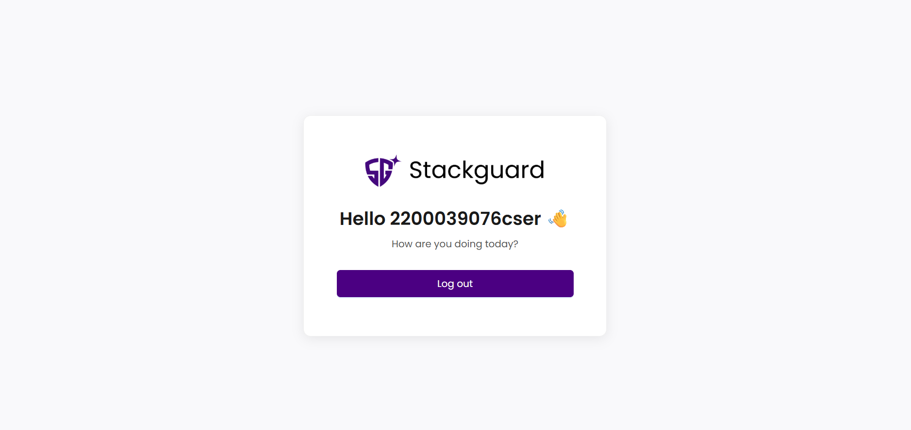

# 🛡️ StackGuard Frontend Task

A modern, responsive authentication flow built with **React**, **Ant Design**, and **Vite** for the **StackGuard Frontend Task**.

This project implements a **multi-page user flow** for authentication and secure configuration verification — inspired by StackGuard’s design system.

---

## 🚀 Features

✅ **User Authentication Flow**
- Sign Up and Sign In pages with validation  
- Smooth toggle between login and registration  

✅ **Protected Routes**
- Configuration page accessible only after authentication  
- Key verification between **100–1000 characters**

✅ **Dashboard**
- Basic protected page shown after successful key verification  

✅ **UI/UX**
- Built with **Ant Design** components  
- Custom CSS for brand consistency (StackGuard purple theme)  
- Poppins font from Google Fonts  
- Fully responsive (mobile-friendly)  

✅ **Bonus**
- Modern animated transitions (Framer Motion)  
- Reusable layout & clean file structure  
- Deployed on **Vercel**

---

## 🧠 Tech Stack

| Layer | Technology |
|--------|-------------|
| Frontend Framework | [React 18](https://react.dev/) |
| Styling | [Ant Design](https://ant.design/), Custom CSS |
| Routing | [React Router DOM](https://reactrouter.com/) |
| Animations | [Framer Motion](https://www.framer.com/motion/) |
| Build Tool | [Vite](https://vitejs.dev/) |
| Deployment | [Vercel](https://vercel.com/) |

---

## 🧩 Project Structure

stackguard-frontend/
├── public/
│ └── favicon.ico
├── src/
│ ├── assets/
│ │ └── logo.png
│ ├── contexts/
│ │ └── AuthContext.jsx
│ ├── pages/
│ │ ├── Auth.jsx
│ │ ├── Config.jsx
│ │ └── Dashboard.jsx
│ ├── App.jsx
│ ├── main.jsx
│ └── index.css
└── package.json 


---

## ⚙️ Installation & Setup

### 1️⃣ Clone the repository
```bash
git clone https://github.com/sureshknxtwave/stackguard-frontend.git
cd stackguard-frontend


2️⃣ Install dependencies
npm install

3️⃣ Run the development server
npm run dev

4️⃣ Build for production
npm run build

5️⃣ Preview build
npm run preview

🧾 Pages Overview
🟣 1. Sign Up / Sign In Page

Path: /auth

Features:

Toggle between Sign In and Sign Up forms

Input validation using Ant Design

Fully responsive two-panel layout

Purple theme consistent with StackGuard branding

🖼️ UI Screenshot:


🟢 2. Configuration Page

Path: /config

Features:

Protected route (only accessible after login)

Public key input validation (100–1000 characters)

Professional background image for secure verification

🖼️ UI Screenshot:
(./src/assets/ui-ss3.png)


🔵 3. Dashboard

Path: /dashboard

Features:

Displays a welcome message and user info

Includes a logout button

Smooth entry/exit animations with Framer Motion

🖼️ UI Screenshot:


💅 Styling Details

Font: Poppins
Added via Google Fonts <link> in index.html
Primary Color: #4B0082 (StackGuard Purple)
Layout: CSS Grid (65%/35%) for left-right layout
Form Components: Styled with Ant Design overrides for inputs and buttons

🔐 Protected Routing Logic

The app uses React Router DOM with a simple AuthContext for state management.
Users cannot access /config or /dashboard without completing the previous step.
<Route path="/auth" element={<Auth />} />
<Route path="/config" element={<ProtectedRoute><Config /></ProtectedRoute>} />
<Route path="/dashboard" element={<PrivateRoute><Dashboard /></PrivateRoute>} />

